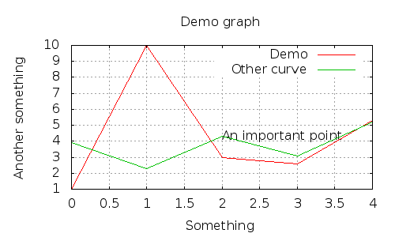

GnuPlot
=======

A PHP Library for using GnuPlot

**WARNING: This invoke the `gnuplot` command line as back-end, which can lead to
arbitrary code execution. Be careful if you intend to use this library with
user-provided information. Have a look at [this post](https://stackoverflow.com/questions/10937597/security-risks-of-gnuplot-web-interface) for more information.**

This is the output of the `demo/write.php`:



Requirements
============

You need to have a server with `gnuplot` installed and the safe mode
disabled (to be able to run `proc_open()`)

Usage
=====

There is examples in the `demo/` directory.

You can create a graph and populate it like this:

```php
<?php

use Gregwar\GnuPlot\GnuPlot;

$plot = new GnuPlot;

// Setting the main graph title
$plot->setGraphTitle('Demo graph');

// Adding three points to the first curve
$plot
    ->setTitle(0, 'The first curve')
    ->push(0, 4)
    ->push(1, 5)
    ->push(2, 6)
    ;

// Adding three points on the other curve and drawing it as a line of connected points, colored in red and smoothed
// (with index 1)
$plot
    ->setTitle(1, 'The first curve')
    ->setLineType(1, 'rgb #ff0000')
    ->setLineMode(1, 'lp')
    ->setLineSmooth(1, GnuPlot::SMOOTH_CSPLINE)
    ->push(0, 8, 1)
    ->push(1, 9, 1)
    ->push(2, 10, 1)
    ;

// Drawing the area between the two curves in blue
$plot
    ->setLineMode(2, GnuPlot::LINEMODE_FILLEDCURVES)
    ->setLineType(2, 'rgb #0000ff')
    ->setTitle(2, 'Area')
    ->push(0, [4, 8], 2)
    ->push(1, [5, 9], 2)
    ->push(2, [6,10], 2)
    ;
```

You can then save it to a file, have a look to `write.php` for example:

```php
<?php

// Write the graph to out.png
$plot->writePng('out.png');
```

Or render it directly into a browser, you can try `out.php` for
example:

```php
<?php

header('Content-type: image/png');
echo $plot->get();
```

Or display it on the screen (useful with CLI scripts), run the
`demo.php` script for example:

```php
<?php

$plot->display();
```

Or display it, and re-feed it in real time (with CLI scripts), you can
run `realTime.php` for example:

```php
<?php

$plot->refresh();
```

API
===

* `push($x, $y, $index=0)`, add a point to the $index-nth curve ($y can be an array if the linemode is `GnuPlot::LINEMODE_FILLEDCURVES`)
* `display()`, renders the graph on the screen (asuming you are using
  it as a CLI with an X Server
* `refresh()`, same as `display()`, but will replot the graph after
  the first call
* `get()`, gets the PNG data for your image
* `writePng($filename)`, writes the data to the output PNG file
* `writePDF($filename)`, writes the data to the output PDF file
* `writeEPS($filename)`, writes the data to the output EPS file
* `setTitle($index, $title)`, sets the title of the $index-nt curve
* `setLineWidth($index, $width)`, sets the width of the $index-nt curve
* `setLineMode($index, $mode)`, sets the line mode of the $index-nt curve (set to `GnuPlot::LINEMODE_FILLEDCURVES` to fill an area between two lines)
* `setLinePoint($index, $point)`, sets the line point of the $index-nt curve
* `setLineType($index, $type)`, sets the line type of the $index-nt curve
* `setLineColor($index, $color)`, sets the line color of the $index-nt curve
* `setLineSmooth($index, $smooth)`, sets the smooth type of the $index-nt curve. Available smooths are `SMOOTH_NONE`, `SMOOTH_BEZIER`, `SMOOTH_CSPLINE`, defined as constants on the `GnuPlot` class.
* `setGraphTitle($title)`, sets the main title for the graph
* `setXTimeFormat($format)`, sets the X axis as a time axis and specify data format
* `setTimeFormatString($format)`, specify the X axis time presentation format
* `setXLabel($text)`, sets the label for the X axis
* `setYLabel($text)`, sets the label for the Y axis
* `setYFormat($format)`, sets Y axis formatting
* `setXRange($min, $max)`, set the X min & max
* `setYRange($min, $max)`, set the Y min & max
* `setXTics($tics)`, set the X tics
* `setYTics($tics)`, set the Y tics
* `setMXTics($tics)`, set the micro X tics
* `setMYTics($tics)`, set the micro Y tics
* `setMinorGrid($status)`, enabled/disables the grid for microtics
* `setGridPlacement($layer)`, sets the placement of the grid, can be `GnuPlot::GRID_DEFAULT`, `GnuPlot::GRID_FRONT` or `GnuPlot::GRID_BACK`
* `setWidth($width)`, sets the width of the graph
* `setHeight($height)`, sets the height of the graph
* `setCanvasWidth($width)`, sets the width of the canvas (if not set, the width value is used)
* `setCanvasHeight($height)`, sets the height of the canvas (if not set, the height value is used)
* `setOrigin($x, $y)`, sets the origin of the graph
* `setSleepTime($sleepTime)`, sets the sleep time after saving a file
* `addLabel($x, $y, $text)`, add some label at a point
* `flush()`, completely flushes the internal state and resets the object to its initial state

License
=======

`Gregwar\GnuPlot` is under MIT license
